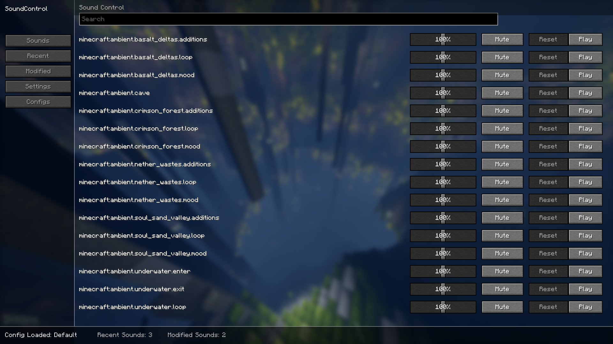
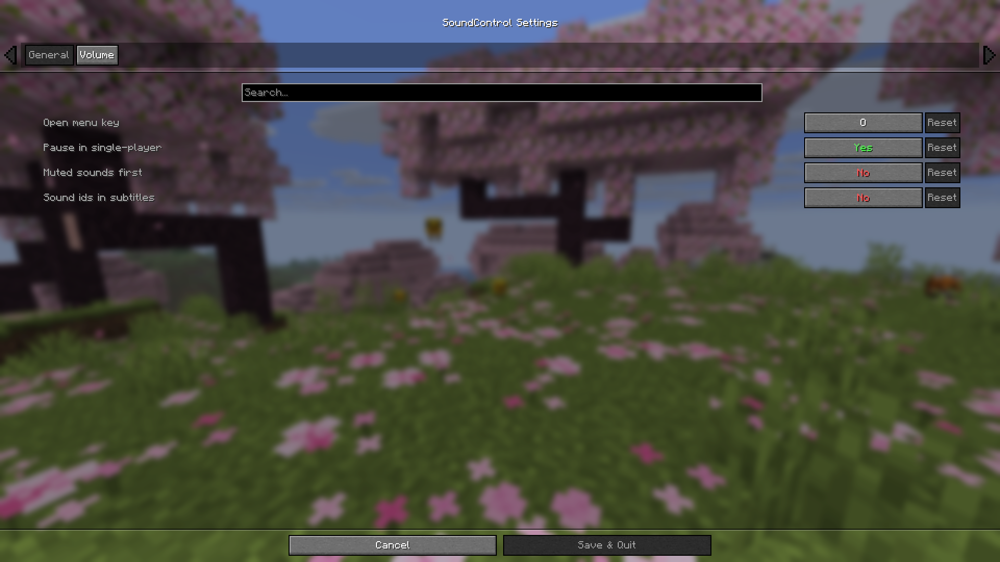
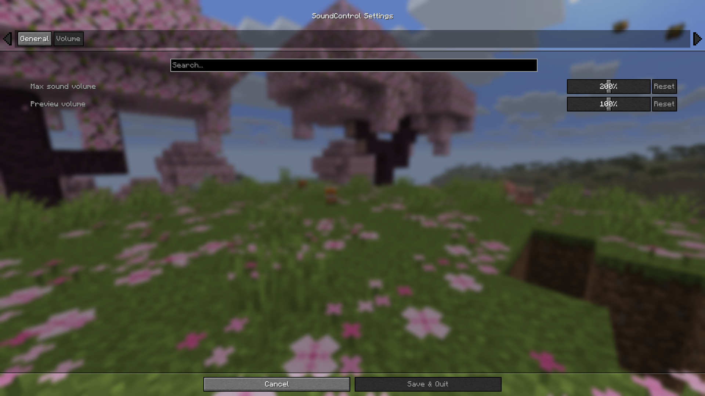

# Sound Control

Please note this mod is in active development and is nowhere near finished.

SoundControl is a client-side mod that lets you search, mute, boost, and manage individual Minecraft sounds from one place.

## Screenshots



| Setting 1 | Setting 2 | 
| --- | --- |
|  |  |

## Supported versions

| Minecraft | Fabric | NeoForge | Forge |
| --- | :---: | :---: | :---: |
| **26.1** | ✓ | ✓ | — |

Larger version support soon to come...

## Features

- Per-sound volume control
- Mute individual sounds
- Boost sounds above 100%
- Recently played sounds
- Search sound ids
- Modified sounds tab
- Sound preview
- Config profiles
- Sound ids in subtitles

More features planned to come very soon...

## Config

Settings and config profiles are stored in **`config/soundcontrol.json`** inside the game directory.

Each profile saves modified sound volumes plus general settings. The active profile is loaded automatically on startup.

**Default settings**

| Setting | Default |
| --- | :---: |
| SoundControl Menu | `o` |
| Pause in single-player | `true` |
| Muted sounds first | `false` |
| Sound ids in subtitles | `false` |
| Max sound volume | `200%` |
| Preview volume | `100%` |

## Dependencies

| Mod | Required | Loaders |
| --- | :---: | --- |
| [Cloth Config API](https://modrinth.com/mod/cloth-config) | ✓ | Fabric, NeoForge |
| [ModMenu](https://modrinth.com/mod/modmenu) | — | Fabric |
| [Better Mods Button](https://modrinth.com/mod/better-mods-button) | — | NeoForge |
| [Better Modlist](https://modrinth.com/mod/better-modlist) | — | NeoForge |

Fabric also requires **Fabric API**.

## Building from source

```powershell
.\gradlew.bat clean :fabric:build :neoforge:build
```

Release jars are copied to `build/release/`.

## Misc

- **License:** [MIT](LICENSE)

### Project Links

- **GitHub:** [Pohci](https://github.com/pohci/soundcontrol)
- **Modrinth:** [Pohci](https://modrinth.com/mod/soundcontrol)
- **CurseForge:** [Pohci](https://www.curseforge.com/minecraft/mc-mods/sound-control-manager)
